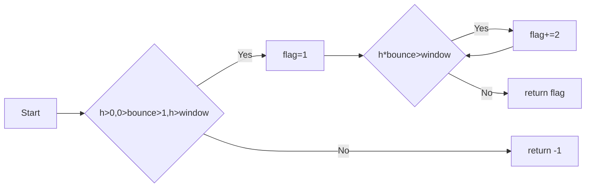

# Python实验报告2： Python变量、简单数据类型
班级： 21计科1班

学号： B20210102113

姓名： 谭志峰

## 第一部分 Python变量、简单数据类型和列表简介

### 练习2.3

代码
```python
  name='TZF'
  print(f"Hello {name},do you love yourself today?")
```

输出
```
Hello TZF,do you love yourself today?
```
### 练习2.4

代码
 ```python
name='TZF'
print(name.title())
print(name.upper())
print(name.lower())
 ```

 输出
```
TZF
TZF
TZF
```
### 练习2.5

代码
```python
str="Everything is possible!"
print(str)
```

输出
```
Everything is possible!
```
### 练习2.6

代码
```python
name="Everything"
message="is possible!"
print(name+message)
```

输出
```
Everything is possible!
```
### 练习2.7

代码
```python
name= ' \t TZF \n '
print(name)
name.rstrip()
name.lstrip()
name.strip()
print(name)
```

输出
```
 	 TZF
 
 	 TZF
```
### 练习2.8

代码
```python
filename='python_notes.txt'
print(filename.removesuffix('.txt'))
```

输出
```
python_notes
```

## 第二部分 Codewars Kata挑战
### 第1题：求离整数n最近的平方数（Find Nearest square number）

难度：8kyu

你的任务是找到一个正整数n的最近的平方数 例如，如果n=111，那么nearest_sq(n)（nearestSq(n)）等于121，因为111比100（10的平方）更接近121（11的平方）。 如果n已经是完全平方（例如n=144，n=81，等等），你需要直接返回n。 

[代码提交地址](https://www.codewars.com/kata/5a805d8cafa10f8b930005ba/train/python) 
```python
from math import ceil, sqrt


def nearest_sq(n):
    shang = ceil(sqrt(n)) ** 2
    xia = int(sqrt(n)) ** 2
    return shang if abs(shang - n) < abs(xia - n) else xia
```
### 第2题：弹跳的球（Bouncing Balls）

难度：6kyu

一个孩子在一栋高楼的第N层玩球。这层楼离地面的高度h是已知的。他把球从窗口扔出去。球弹了起来, 例如:弹到其高度的三分之二（弹力为0.66）。他的母亲从离地面w米的窗户向外看,母亲会看到球在她的窗前经过多少次（包括球下落和反弹的时候）？

一个有效的实验必须满足三个条件：

1. 参数 "h"（米）必须大于0
2. 参数 "bounce "必须大于0且小于1
3. 参数 “window "必须小于h。

如果以上三个条件都满足，返回一个正整数，否则返回-1。 注意:只有当反弹球的高度严格大于窗口参数时，才能看到球。 

[代码提交地址](https://www.codewars.com/kata/5544c7a5cb454edb3c000047/train/python)
```python
def bouncing_ball(h, bounce, window):
    if h>0.0 and 0.0<bounce<1.0 and h>window:
        cnt=1
        while h*bounce>window:
            h*=bounce
            cnt+=2
        return cnt
    return -1
```

### 第3题： 元音统计(Vowel Count)

难度： 7kyu

返回给定字符串中元音的数量（计数）。对于这个Kata，我们将考虑a、e、i、o、u作为元音（但不包括y）。输入的字符串将只由小写字母和/或空格组成。

[代码提交地址](https://www.codewars.com/kata/54ff3102c1bad923760001f3)
```python
def get_count(sentence):
    yy="aoeiu"
    cnt=0
    for c in yy:
        cnt+=sentence.count(c)
    return cnt
```

### 第4题：偶数或者奇数（Even or Odd）
难度：8kyu

创建一个函数接收一个整数作为参数，当整数为偶数时返回”Even”当整数位奇数时返回”Odd”。 

[代码提交地址](https://www.codewars.com/kata/53da3dbb4a5168369a0000fe) 
```python
def even_or_odd(number):
    return "Odd" if number%2 else "Even"
```

## 第三部分 使用Mermaid绘制程序流程图

安装Mermaid的VSCode插件：

- Markdown Preview Mermaid Support
- Mermaid Markdown Syntax Highlighting

使用Markdown语法绘制你的程序绘制程序流程图（至少一个），Markdown代码如下：

### 弹跳的球（Bouncing Balls）用Mermaid绘制的流程图如下：


## 第四部分 总结补充:将代码上传到Github
### 第一部分 实验环境的安装
1.安装git，从git官网下载后直接点击可以安装：git官网地址

2.从Github克隆课程的仓库：课程的仓库地址，运行git bash应用（该应用包含在git安装包内），在命令行输入下面的命令（命令运行成功后，课程仓库会默认存放在Windows的用户文件夹下）

**遇到的问题：**

**1.在创建的文件夹下右键无法显示快捷Git Bash Here**

解决办法：
```
这个问题的解决就是要将你安装时候配置的路径给它修改成现在的存放路径，自然要去注册表中进行更改，使用win + R,输入regedit打开注册表
在HKEY_CLASSES_ROOT\Directory\Background\shell目录下
在git_gui中修改Icon选项值，会发现并不是你现在存放git的地方，将值替换成你现在存放git的本地对应地址，然后在对应的command中也要进行修改。之后对git_shell也进行上述的两步操作
到此修改完了第一处地方，还有一处地方：HKEY_CLASSES_ROOT\Directory\shell
目录名和文件名都是一样的，对其进行与第一处相同的修改即可，之后重试就发现OK了
```
**2.无法克隆Github仓库，并且无法上传本地文件**

解决办法：
```
先要将远程仓库关联到本地仓库
GitHub上传流程(总结)：
1.cd python_tasks/   跳转到GitHub目录下（或者找到文件右击，Git Bash Here）
2.git init  初始化
报错：Reinitialized existing Git repository in…  说明已经存在.git文件了
3.git add . 
提交到缓存区。这里的"add"和“ . ”中间有个空格。如果不写空格，git无法识别。“add .” 这里就是添加所有文件的意思
4.git add test.md   
该操作可以直接添加文件
5.git commit -m "测试文件"   添加操作备注
6.git push （本地仓库推送到远程仓库）
是将本地版本库的分支推送到远程服务器上对应的分支,提交到远程的github仓库,。（此操作目的是把本地仓库push到github上面

```


## 实验考查

请使用自己的语言并使用尽量简短代码示例回答下面的问题，这些问题将在实验检查时用于提问和答辩以及实际的操作。

1. Python中的简单数据类型有那些？我们可以对这些数据类型做哪些操作？
    
```python
Python中的简单数据类型包括：
（1）整数（int）（2） 浮点数（float）（3） 布尔值（bool）（4） 字符串（str）
我们可以对这些数据类型进行以下操作：
（1） 整数：加减乘除、取余数、幂运算、比较运算、位运算等。
（2）浮点数：加减乘除、比较运算等。
（3）布尔值：逻辑运算（与、或、非）、比较运算等。
（4）字符串：拼接、重复、截取、查找、替换、大小写转换等。
``````
2. 为什么说Python中的变量都是标签？
```
在Python中，变量被视为标签而不是存储值的容器。这是因为Python中的变量实际上是对内存中某个对象的引用。当我们为变量赋值时，实际上是将变量标签指向了一个对象，而不是将值直接存储在变量中。
这种标签的概念意味着多个变量可以引用同一个对象。
```
3. 有哪些方法可以提高Python代码的可读性？
```
1.代码布局

（1）缩进。标准Python风格中每个缩进级别使用4个空格，不推荐使用Tab，禁止混用空格与Tab。

（2）行的最大长度。每行最大长度79，换行可以使用反斜杠，但建议使用圆括号。

（3）空白行。顶层函数和定义的类之间空两行，类中的方法定义之间空一行；函数内逻辑无关的代码段之间空一行，其他地方尽量不要空行。

2.空格的使用

（1）右括号前不要加空格。

（2）逗号、冒号、分号前不要加空格。

（3）函数的左括号前不要加空格，如fun（1）。

（4）序列的左括号前不要加空格，如list[2]。

（5）操作符左右各加一个空格，如a+b=c。

（6）不要将多条语句写在同一行。

（7）if、for、while语句中，即使执行语句只有一句，也必须另起一行。

3.代码注释

（1）块注释。块注释跟随被注释的代码，缩进至与代码相同的级别。块注释使用“#”开头。

（2）行内注释。行内注释是与代码语句同行的注释。行内注释与代码至少由两个空格分隔，注释以“#”开头。

（3）文档字符串。文档字符串指的是为所有公共模块、函数、类以及方法编写的文档说明。文档字符串使用三引号包裹。

4.命名规范

（1）不要使用字母“I”（L的小写）、“0”（大写0）、“I”（大写I）作为单字符变量名。

（2）模块名、包名应简短且全为小写。

（3）函数名应该小写，如果想提高可读性，可以用下画线分隔小写单词。

（4）类名首字母一般使用大写。

（5）常量通常采用全大写命名

```

## 实验总结

总结一下这次实验你学习和使用到的知识，例如：编程工具的使用、数据结构、程序语言的语法、算法、编程技巧、编程思想。

 **通过此次实验课程，遇到了一系列问题，通过不断的探索和请教，得到了解决。对python语言有了一个更加清晰的认识，包括python的一些基本语句的规范使用以及对一些函数的使用也更加熟练，同时通过网上查询资料，学到了很多方法使python代码更加具有可读性，例如对代码空格，布局以及注释的使用也变得规范起来了。**