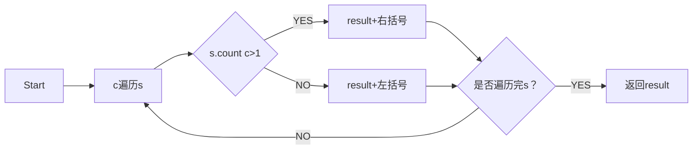
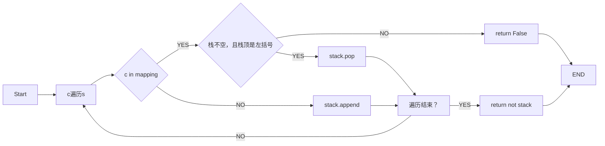

# 实验三 Python列表

班级： 21计科01

学号： B20210102113

姓名： 谭志峰

Github地址：https://github.com/bahdksnxja/python_tasks

CodeWars地址：https://www.codewars.com/users/bahdksnxja

---

## 实验目的

1. 学习Python的简单使用和列表操作
2. 学习Python中的if语句

## 实验环境

1. Git
2. Python 3.10
3. VSCode
4. VSCode插件

## 实验内容和步骤

### 第一部分

Python列表操作

完成教材《Python编程从入门到实践》下列章节的练习：

**第3章 列表简介**
```
#练习3.4
lists = ["lei","deng","liu"]
print(lists)
```

```
#练习3.5
print(lists[0] +"无法赴约")
lists[0] = 'tan'
print(lists)
```
```
#练习3.6
lists.insert(0,'dong')
print(lists)
lists.insert(2,'feng')
print(lists)
lists.append('jin')
print(lists)
```
```
#练习3.7
for n in range(0,4):
    num = 1
    num+=1
    leave = lists.pop(num)
    print(leave +"  sorry you can not come this party")
for n in range(0,2):
    del lists[0]
print(lists)
```

**第4章 操作列表**
```
#练习4.11
pizzas = ['seafood', 'sausage', 'cheese']
friend_pizzas = pizzas[:]
 
pizzas.append("hotdog")
friend_pizzas.append("vegetable")
 
print("my favorite pizzas are:")
for pizza in pizzas:
    print(pizza)
print("my friend favorite pizzas are:")
for pizza in friend_pizzas:
    print(pizza)
```


**第5章 if语句**

```
#练习5.6
age = 100
if age < 2:
    print("This is a baby")
elif 2 <= age < 4:
    print("this is a kid")
elif 4 <= age < 13:
    print("this is a child")
elif 13 <= age < 20:
    print("this is a teenager")
elif 20 <= age < 65:
    print("this is an adult")
else:
    print("this is an old man")
```

---

### 第二部分

在[Codewars网站](https://www.codewars.com)注册账号，完成下列Kata挑战：

---

#### 第一题：3和5的倍数（Multiples of 3 or 5）


代码提交地址：
<https://www.codewars.com/kata/514b92a657cdc65150000006>

---
**代码**
```
def solution(number):
    return sum(i for i in range(number) 
              if  i%3 ==0 or i%5==0)
```

#### 第二题： 重复字符的编码器（Duplicate Encoder）
代码提交地址:
<https://www.codewars.com/kata/54b42f9314d9229fd6000d9c>

---
**代码**
```
def duplicate_encode(word):
    word = word.lower()
    return ''.join('(' if word.count(c)<2 else ')' for c in word)
```

#### 第三题：括号匹配（Valid Braces）

代码提交地址
<https://www.codewars.com/kata/5277c8a221e209d3f6000b56>

---
**代码**
```
braces = "() {} []"

def validBraces(string) :
    stack = []
    for c in string :
        if c in '({[':
            stack.append(c)
        elif c in')}]':
            if not stack :
                return False
            if stack[-1]!= braces[braces.index (c) -1]:
                return False
            else:
                stack.pop()
    if not stack:
      return True
    else:
      return False
```

#### 第四题： 从随机三元组中恢复秘密字符串(Recover a secret string from random triplets)

代码提交地址：

<https://www.codewars.com/kata/53f40dff5f9d31b813000774/train/python>

**代码**
```
    def recoverSecret(triplets):
    'triplets is a list of triplets from the secrent string. Return the string.'
    lic = []
    for i in range(len(triplets)):
        for j in range(len(triplets[i])):
            lic.append(triplets[i][j])
 
    lic = set(lic)
    lic = list(lic)
    while True:
        cnt = 0
        for i in range(len(triplets)):
            for j in range(len(triplets[i]) - 1):
                a = triplets[i][j]
                b = triplets[i][j + 1]
                index_a = lic.index(a)
                index_b = lic.index(b)
                if index_a > index_b:
                    temp = lic[index_b]
                    lic[index_b] = lic[index_a]
                    lic[index_a] = temp
                    cnt += 1
        if cnt == 0:
            return ''.join(lic)
```

#### 第五题： 去掉喷子的元音（Disemvowel Trolls）
代码提交地址：
<https://www.codewars.com/kata/52fba66badcd10859f00097e>

**代码**
```
def disemvowel(string):
    vowels = ['a', 'e', 'i', 'o', 'u', 'A', 'E', 'I', 'O', 'U']
    result = []
    for s in string:
        if s not in vowels:
            result.append(s)    
    return "".join(result)

```

---

### 第三部分

使用Mermaid绘制程序流程图

#### 第二题： 重复字符的编码器（Duplicate Encoder）

#### 第三题：括号匹配（Valid Braces）



## 实验考查

请使用自己的语言并使用尽量简短代码示例回答下面的问题，这些问题将在实验检查时用于提问和答辩以及实际的操作。

1. Python中的列表可以进行哪些操作？
```
Python中的列表可以进行以下操作：
1. 添加元素：使用`append()`方法在列表末尾添加元素，使用`insert()`方法在指定位置插入元素。
2. 删除元素：使用`remove()`方法删除指定元素，使用`pop()`方法删除指定位置的元素。
3. 访问元素：使用索引访问列表中的元素，索引从0开始。
4. 切片操作：使用切片操作符`[start:end]`获取列表的一个子列表。
5. 修改元素：使用索引对列表中的元素进行修改。
6. 长度：使用`len()`函数获取列表的长度。
7. 排序：使用`sort()`方法对列表进行升序排序，使用`reverse()`方法将列表逆序排列。
8. 迭代：使用`for`循环遍历列表中的元素。
9. 列表合并：使用`+`操作符将两个列表合并。
10. 列表复制：使用`copy()`方法复制一个列表。
11. 列表查找：使用`in`关键字或`index()`方法查找列表中是否存在指定元素。
12. 列表统计：使用`count()`方法统计列表中指定元素的个数。
13. 列表清空：使用`clear()`方法清空列表中的所有元素。
```
2. 哪两种方法可以用来对Python的列表排序？这两种方法有和区别？
```
Python的列表可以使用`sort()`方法和`sorted()`函数来进行排序。
`sort()`方法是列表对象的一个方法，它可以对列表进行原地排序，即直接修改原列表中的元素顺序。`sort()`方法有两个可选参数：`reverse`和`key`，分别表示是否逆序排序和排序的关键字。如果不指定这些参数，则默认按照元素的大小进行升序排序。
`sorted()`函数是Python内置函数，它可以对任意可迭代对象进行排序，并返回一个新的排好序的列表。与`sort()`方法不同，`sorted()`函数不会修改原对象，而是返回一个新的列表。`sorted()`函数也有两个可选参数：`reverse`和`key`，与`sort()`方法的参数含义相同。

两种方法的主要区别在于是否修改原列表。如果需要对原列表进行排序，则应该使用`sort()`方法；如果不想修改原列表，而是生成一个新的排好序的列表，则应该使用`sorted()`函数。
```
3. 如何将Python列表逆序打印？
```
可以使用reverse()方法将列表逆序排列，然后使用for循环遍历并打印逆序后的列表元素
也可以使用切片操作符[::-1]来获取列表的逆序子列表，然后使用for循环遍历并打印。
```
4. Python中的列表执行哪些操作时效率比较高？哪些操作效率比较差？是否有类似的数据结构可以用来替代列表？
```
在Python中，列表执行以下操作时效率比较高：
1. 访问元素：通过索引访问列表中的元素的时间复杂度为O(1)，即常数时间。
2. 添加元素：使用`append()`方法在列表末尾添加元素的时间复杂度为O(1)。
3. 切片操作：获取列表的子列表的时间复杂度为O(k)，其中k为切片的长度。
4. 迭代：使用`for`循环遍历列表中的元素的时间复杂度为O(n)，其中n为列表的长度。

而以下操作的效率比较低：
1. 插入元素：使用`insert()`方法在指定位置插入元素的时间复杂度为O(n)，其中n为列表的长度。因为插入元素后，需要将插入位置后面的元素都向后移动一位。
2. 删除元素：使用`remove()`方法删除指定元素的时间复杂度为O(n)，其中n为列表的长度。因为删除元素后，需要将删除位置后面的元素都向前移动一位。
3. 排序：使用`sort()`方法对列表进行排序的时间复杂度为O(nlogn)，其中n为列表的长度。
4. 列表合并：使用`+`操作符将两个列表合并的时间复杂度为O(n)，其中n为两个列表的总长度。

如果对于需要频繁进行插入、删除和排序操作的场景，可以考虑使用链表（LinkedList）这样的数据结构来替代列表。链表在插入和删除元素时的时间复杂度为O(1)，而在访问元素时的时间复杂度为O(n)。Python中的`collections`模块提供了`deque`类，它是一个双端队列，可以用作链表的替代。`deque`类提供了高效的插入和删除操作，并且可以从两端进行操作。
```
5. 阅读《Fluent Python》Chapter 2. An Array of Sequence - Tuples Are Not Just Immutable Lists小节（p30-p35）。总结该小节的主要内容。
```
元组是不可变的序列：元组是一种不可变的序列类型，一旦创建后就不能修改。元组可以包含任意类型的对象，并且可以通过索引进行访问。

元组可以用作记录：元组可以将多个对象组合在一起，形成一个记录。每个元素在元组中的位置都有特定的含义，可以通过解包（unpacking）的方式将元组中的元素赋值给多个变量。

元组可以用作函数的返回值：函数可以返回一个元组，将多个值一起返回。这样可以方便地返回多个相关的值，而不需要使用额外的数据结构。

元组可以用作字典的键：元组是不可变的，因此可以作为字典的键。而列表是可变的，不能作为字典的键。

元组可以用作函数的参数：元组可以用作函数的参数，可以将多个参数打包成一个元组，然后传递给函数。

元组拆包：可以将元组中的元素解包（unpacking）到多个变量中。拆包可以通过位置匹配或者使用*运算符进行。

元组中的元素可以是可变对象：虽然元组本身是不可变的，但是元组中的元素可以是可变对象。这意味着，如果元组中的元素是可变对象，那么可以修改可变对象的属性或者通过可变对象的方法来修改。

总的来说，元组是一种不可变的序列类型，适用于包含多个相关值的场景。元组具有不可变性、可以用作记录、函数返回值、字典键和函数参数的特点。

```
## 实验总结

总结一下这次实验你学习和使用到的知识，例如：编程工具的使用、数据结构、程序语言的语法、算法、编程技巧、编程思想。

**通过本次实验学习了元组以及列表的一些基本理论知识，同时通过编程实现了了书本上的一些题目的需求。通过学习也发现了，元组和列表的一些区别：元组它的关键是不可变性。如果在程序中以列表的形式传递一个对象的集合，它可能在任何地方改变；如果使用元组的话，则不能。元组提供了一种完整的约束。**