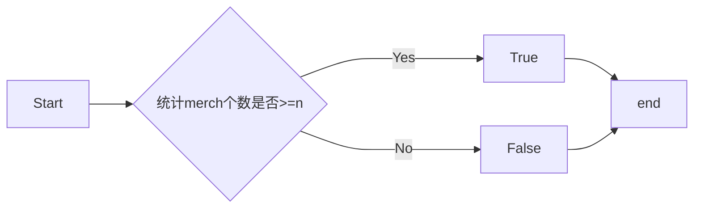

# 实验四 Python字典和while循环

班级： 21计科01

学号： B20210102113

姓名： 谭志峰

Github地址    : https://github.com/bahdksnxja/python_tasks

CodeWars地址：：https://www.codewars.com/users/bahdksnxja

---

## 实验目的

1. 学习Python字典
2. 学习Python用户输入和while循环
```
#练习6.3
dics = {
    'list':'列表',
    'var':'变量',
    'int':'整型',
    'boolean':'布尔',
    'str':'字符串'
    }
print('dics[\'list\']'+':' + dics['list'])
print('dics[\'var\']'+':' + dics['var'])
print('dics[\'int\']'+':' + dics['int'])
print('dics[\'boolean\']'+':' + dics['boolean'])
print('dics[\'str\']'+':' + dics['str'])
```

```
#练习6.5
water={
    'a' : 'aa',
    'b' : 'bb',
    'c' : 'cc',
    'd' : 'dd'
}
for w,n in water.items():
    print(f"The {w.title()} runs through {n.title()}.")
for w in water.keys():
    print(w)
for n in water.values():
    print(n)
```

```
#练习6.9
favorite_places={
    'yuan_lin':{
        'name':'yuan lin',
        'old':24,
        'thinks':'happy',
        'friend':'zhao hailin',
        'urban':'Bei jing',
        },

    'zhao_hai_lin':{
        'name':'zhao hai lin',
        'old':24,
        'thinks':'happy',
        'friend':'yuan lin',
        'urban':'Bei jing',
        },

    'wang_jin':{
        'name':'wang jin',
        'old':24,
        'thinks':'happy',
        'friend':'wang jin',
        'urban':'Bei jing',
        },
    }
for peoples,lis in favorite_places.items():
    print(peoples)
    for n,m in lis.items():
        print(f"{n}:{m}")
    print('\n')

```
## 实验环境

1. Git
2. Python 3.10
3. VSCode
4. VSCode插件

## 实验内容和步骤

### 第一部分

Python列表操作


### 第二部分

在[Codewars网站](https://www.codewars.com)注册账号，完成下列Kata挑战：

---

#### 第一题：淘气还是乖孩子（Naughty or Nice）
代码提交地址：
<https://www.codewars.com/kata/5662b14e0a1fb8320a00005c>

```python
def naughty_or_nice(data):
    naughty_count = 0
    nice_count = 0

    for month in data:
        for day in data[month]:
            if data[month][day] == 'Naughty':
                naughty_count += 1
            elif data[month][day] == 'Nice':
                nice_count += 1

    if nice_count >= naughty_count:
        return "Nice!"
    else:
        return "Naughty!"

# Example usage
data = {
    'January': {
        '1': 'Naughty', '2': 'Naughty', '31': 'Nice'
    },
    'February': {
        '1': 'Nice', '2': 'Naughty', '28': 'Nice'
    },
    'December': {
        '1': 'Nice', '2': 'Nice', '31': 'Naughty'
    }
}

result = naughty_or_nice(data)
print(result)
```


---

#### 第二题： 观察到的PIN（The observed PIN）
代码提交地址：
<https://www.codewars.com/kata/5263c6999e0f40dee200059d>
```
Dict = {'1':['1','2','4'], '2':['1','2','3','5'], '3':['2','3','6'], '4':['1','4','5','7'], 
        '5':['2','4','5','6','8'], '6':['3','5','6','9'], '7':['4','7','8'], '8':['5','7','8','9','0'], 
        '9':['6','8','9'], '0':['0','8']}

def get_pins(observed):
    if len(observed) == 1:
        return Dict[observed]
    else:
        res  = []
        first = observed[0]
        rest = get_pins(observed[1:])
        for each in Dict[first]:
            for every in rest:
             res.append(each+every)
        
        return res
```

---

#### 第三题： RNA到蛋白质序列的翻译（RNA to Protein Sequence Translation）
代码提交地址：
<https://www.codewars.com/kata/555a03f259e2d1788c000077>

Amino Acid Dictionary

```python
   # Your dictionary is provided as PROTEIN_DICT
   PROTEIN_DICT = {
    # Phenylalanine
    'UUC': 'F', 'UUU': 'F',
    # Leucine
    'UUA': 'L', 'UUG': 'L', 'CUU': 'L', 'CUC': 'L', 'CUA': 'L', 'CUG': 'L',
    # Isoleucine
    'AUU': 'I', 'AUC': 'I', 'AUA': 'I',
    # Methionine
    'AUG': 'M',
    # Valine
    'GUU': 'V', 'GUC': 'V', 'GUA': 'V', 'GUG': 'V',
    # Serine
    'UCU': 'S', 'UCC': 'S', 'UCA': 'S', 'UCG': 'S', 'AGU': 'S', 'AGC': 'S',
    # Proline
    'CCU': 'P', 'CCC': 'P', 'CCA': 'P', 'CCG': 'P',
    # Threonine
    'ACU': 'T', 'ACC': 'T', 'ACA': 'T', 'ACG': 'T',
    # Alanine
    'GCU': 'A', 'GCC': 'A', 'GCA': 'A', 'GCG': 'A',
    # Tyrosine
    'UAU': 'Y', 'UAC': 'Y',
    # Histidine
    'CAU': 'H', 'CAC': 'H',
    # Glutamine
    'CAA': 'Q', 'CAG': 'Q',
    # Asparagine
    'AAU': 'N', 'AAC': 'N',
    # Lysine
    'AAA': 'K', 'AAG': 'K',
    # Aspartic Acid
    'GAU': 'D', 'GAC': 'D',
    # Glutamic Acid
    'GAA': 'E', 'GAG': 'E',
    # Cystine
    'UGU': 'C', 'UGC': 'C',
    # Tryptophan
    'UGG': 'W',
    # Arginine
    'CGU': 'R', 'CGC': 'R', 'CGA': 'R', 'CGG': 'R', 'AGA': 'R', 'AGG': 'R',
    # Glycine
    'GGU': 'G', 'GGC': 'G', 'GGA': 'G', 'GGG': 'G',
    # Stop codon
    'UAA': 'Stop', 'UGA': 'Stop', 'UAG': 'Stop'
}
```

```
def protein(rna):
    # 从RNA链上三个字母一组成为一个密码子
    codons = [rna[i:i+3] for i in range(0, len(rna), 3)]
    chain = []
    for codon in codons:
        if PROTEIN_DICT[codon] != 'Stop':
            chain.append(PROTEIN_DICT[codon])
        else:
            break
    return ''.join(chain)
print(protein('AUGGUUAGUUGA'))

```


---

#### 第四题： 填写订单（Thinkful - Dictionary drills: Order filler）
代码提交地址：
<https://www.codewars.com/kata/586ee462d0982081bf001f07/python>

```
def fillable(stock, merch, n):    
    # 商品所对应的键可能不在字典中，所以要用get方法
    # 不能用这个方法  stock[merch] >= n
    return stock.get(merch, 0) >= n
```
---

#### 第五题： 莫尔斯码解码器（Decode the Morse code, advanced）

代码提交地址：
<https://www.codewars.com/kata/decode-the-morse-code-advanced>

下面是Morse码支持的完整字符列表：

```javascript
A    ·–
B    –···
C    –·–·
D    –··
E    ·
F    ··–·
G    ––·
H    ····
I    ··
J    ·–––
K    –·–
L    ·–··
M    ––
N    –·
O    –––
P    ·––·
Q    ––·–
R    ·–·
S    ···
T    –
U    ··–
V    ···–
W    ·––
X    –··–
Y    –·––
Z    ––··
0    –––––
1    ·––––
2    ··–––
3    ···––
4    ····–
5    ·····
6    –····
7    ––···
8    –––··
9    ––––·
.    ·–·–·–
,    ––··––
?    ··––··
'    ·––––·
!    –·–·––
/    –··–·
(    –·––·
)    –·––·–
&    ·–···
:    –––···
;    –·–·–·
=    –···–
+    ·–·–·
-    –····–
_    ··––·–
"    ·–··–·
$    ···–··–
@    ·––·–·
```

```
MORSE_CODE['_'] = ' '

def decodeBits(bits):
    # 去掉开始的0和结尾的0
    bits = bits.strip('0')
    
    # if no zeros in bits
    if '0' not in bits:
        return '.'
    
    # check for multiple bits per dot
    minOnes = min(len(s) for s in bits.split('0') if s)
    minZeros = min(len(s) for s in bits.split('1') if s)
    m = min(minOnes, minZeros)
    
    # decode bits to morse code
    return bits.replace('111'*m, '-').replace('0000000'*m, ' _ ').replace('000'*m, ' ').replace('1'*m, '.').replace('0'*m, '')

def decodeMorse(morseCode):
    # decode morse code to letters
    return ''.join(MORSE_CODE[c] for c in morseCode.split())

```
---

### 第三部分

使用Mermaid绘制程序流程图

**第四题**

显示效果如下：




## 实验考查

请使用自己的语言并使用尽量简短代码示例回答下面的问题，这些问题将在实验检查时用于提问和答辩以及实际的操作。

1. 字典的键和值有什么区别？
   ```
   字典的键（key）和值（value）是两个不同的概念。键（key）是字典中用于唯一标识和访问值的对象。它们必须是不可变的数据类型，如字符串、整数或元组。字典中的每个键必须是唯一的，如果有重复的键，则后面的键会覆盖前面的键。值（value）是字典中与键相关联的数据对象。它们可以是任何类型的数据，如字符串、整数、列表、字典等。一个字典可以包含多个键值对，每个键值对由一个键和一个值组成，键和值之间用冒号（:）分隔。在字典中，通过键可以快速访问对应的值，这是字典的主要特点之一。键和值之间是一一对应的关系，通过键可以找到对应的值，但通过值无法确定对应的键。
   ```

2. 在读取和写入字典时，需要使用默认值可以使用什么方法？
   ```
   在Python中，可以使用get()方法来读取字典中的值，并且可以设置默认值。get()方法接受两个参数，第一个参数是要获取的键，第二个参数是默认值。如果字典中存在该键，则返回对应的值；如果字典中不存在该键，则返回设置的默认值。在写入字典时，可以使用索引赋值的方式，如果键存在则更新对应的值，如果键不存在则新增键值对
   ```
3. Python中的while循环和for循环有什么区别？
   ```
   (1)while循环适用于不知道循环次数的情况，而for循环适用于已知循环次数的情况。(2)while循环的循环条件是在循环体内部进行判断的，而for循环的循环条件是在循环头部进行判断的。(3)while循环的循环条件可以是任何表达式，只要结果为True或False，而for循环的循环条件必须是可迭代对象，如列表、元组、字符串等。(4)while循环可以使用break和continue语句来控制循环的流程，而for循环也可以使用break和continue语句，但是它还可以使用else语句，在循环结束后执行一些操作
   ```
4. 阅读[PEP 636 – Structural Pattern Matching: Tutorial](https://peps.python.org/pep-0636/), 总结Python 3.10中新出现的match语句的使用方法。
```
在Python 3.10中，引入了一种新的语句match，用于实现结构化模式匹配。该语句可以用于对不同的数据结构进行匹配和解构，类似于其他编程语言中的模式匹配功能。

以下是Python 3.10中match语句的使用方法总结：

match语句由match关键字开始，后面跟着要匹配的表达式和一系列的case分支。

case分支由case关键字开始，后面跟着要匹配的模式和一个冒号（:）。

每个case分支可以包含一个或多个模式，用逗号分隔。模式可以是常量、变量、类型、字面量、通配符等。

当match语句执行时，它会按顺序检查每个case分支，直到找到与表达式匹配的模式。一旦找到匹配的模式，相应的代码块将被执行。

每个case分支的代码块可以包含任意的Python代码，可以使用匹配到的模式解构数据。

case分支可以使用|操作符连接多个模式，表示多个模式之间的或关系。

case分支可以使用if子句来添加额外的条件，只有当条件为真时，才会执行对应的代码块。

case分支可以使用_作为通配符，表示匹配任意值。

case分支可以使用...表示省略匹配，用于匹配任意数量的元素。

match语句可以使用case _:作为默认分支，用于处理未匹配到的情况。
```
## 实验总结

总结一下这次实验你学习和使用到的知识，例如：编程工具的使用、数据结构、程序语言的语法、算法、编程技巧、编程思想。

**通过这次实验学习和掌握了字典在操作的时候的注意事项，在读取和写入的时候使用相应的方法，其次在写代码的时候一定要注意规范，不然就容易报错，debug的过程也会变长。**