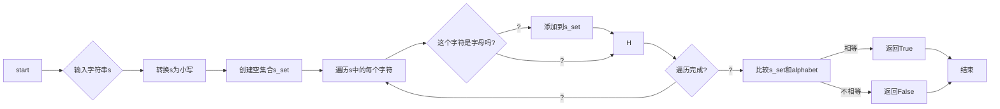
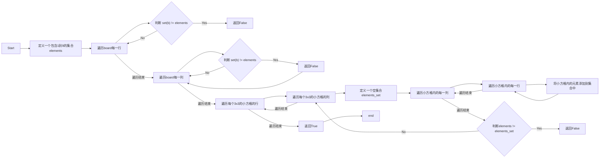
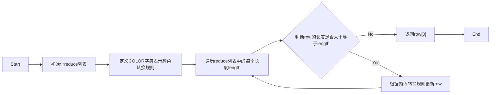

# 实验五 Python数据结构与数据模型

班级： 21计科01

学号： B20210102113

姓名： 谭志峰

Github地址    : https://github.com/bahdksnxja/python_tasks

CodeWars地址：：https://www.codewars.com/users/bahdksnxja

---

## 实验过程与结果

请将实验过程与结果放在这里，包括：

- [第一部分 Codewars Kata挑战](#第一部分)    

#### 第一题：停止逆转我的单词    
代码提交地址：
<https://www.codewars.com/kata/5264d2b162488dc400000001>

```python
def spin_words(sentence):
    words = sentence.split()  
    words1 = []
    for word in words:
        if len(word) > 4: 
            word = word[::-1] 
        words1.append(word)
    return ' '.join(words1) 

```

#### 第二题： 发现离群的数(Find The Parity Outlier)    
代码提交地址：
<https://www.codewars.com/kata/5526fc09a1bbd946250002dc>
```python

def find_outlier(integers):
    even_num=0
    odd_num=0
    even=None
    odd=None
    for i in integers:
        if(i%2==0):
            odd_num+=1
            odd=i
        else:
            even_num+=1
            even=i
    if(odd_num>even_num):
        return even
    else:
        return odd

```      


#### 第三题： 检测Pangram    
代码提交地址：
<https://www.codewars.com/kata/545cedaa9943f7fe7b000048>

```
def is_pangram(s):
    alphabet = set('abcdefghijklmnopqrstuvwxyz')
    s = s.lower()
    s_set = set([char for char in s if char.isalpha()])
    return s_set == alphabet

```     


#### 第四题： 数独解决方案验证    
代码提交地址：
<https://www.codewars.com/kata/63d1bac72de941033dbf87ae>

```python

def validate_sudoku(board):
    elements = set(range(1, 10))

    for b in board:
        if set(b) != elements: 
            return False
    for b in zip(*board):  
        if set(b) != elements: 
            return False

    for i in range(3, 10, 3):
        for j in range(3, 10, 3):
            elements_set = set()
            for w in range(j-3, j):
                for q in range(i-3, i):
                    elements_set.add(board[q][w])
            if elements != elements_set:
                return False
            
    return True

```    


#### 第五题： 疯狂的彩色三角形    
代码提交地址：
<https://www.codewars.com/kata/5a331ea7ee1aae8f24000175>

```python

def triangle(row):
    reduce=[3**i+1 for i in range(10) if 3**i<=100000][::-1]
    
    COLOR = {'GG':'G', 'BB':'B', 'RR':'R', 'BR':'G', 
            'BG':'R', 'GB':'R', 'GR':'B', 'RG':'B', 'RB':'G'}

    for length in reduce:
        while len(row)>=length:
            row=[ COLOR[row[i] + row[i+length-1]] for i in range(len(row)-length+1)]
    return row[0]

```


- [第二部分 使用Mermaid绘制程序流程图](#第二部分)
#### 第三题： 检测Pangram    



#### 第四题： 数独解决方案验证   
 


#### 第五题： 疯狂的彩色三角形  




代码运行结果的文本可以直接粘贴在这里。

**注意：不要使用截图，因为Markdown文档转换为Pdf格式后，截图会无法显示。**

## 实验考查

请使用自己的语言并使用尽量简短代码示例回答下面的问题，这些问题将在实验检查时用于提问和答辩以及实际的操作 ?

1. 集合（set）类型有什么特点？它和列表（list）类型有什么区别？
```
集合（set）类型是Python中的丢 种无序  可变的数据类型，它具有以下几个特点 
1. 无序性：集合中的元素没有固定的顺序，每次输出的顺序可能不同  
2. 唯一性：集合中的元素是唯丢 的，不会出现重复的元素  
3. 可变性：集合是可变的，可以添加  删除和修改集合中的元素.

集合类型和列表（list）类型之间有以下几个区别 
1. 顺序性：列表是有序的，元素的顺序是固定的，可以  过索引访问和修改元素    集合是无序的，元素的顺序是不确定的，不能  过索引访问和修改元素  
2. 唯一性：列表中可以包含重复的元素，  集合中的元素是唯一的，不会出现重复 
3. 可变性：列表是可变的，可以通过索引对元素进行修改  添加和删除。  集合也是可变的，可以添加和删除元素，但不能通过索引对元素进行修改  
4. 存储方式：列表使用方括号（`[]`）来表示，元素之间使用逗号分隔。  集合使用花括号（`{}`）来表示，元素之间也使用逗号分隔 
```
2. 集合（set）类型主要有那些操作 ?
```
集合（set）类型在Python中具有以下常用的操作 
1. 创建集合：可以使用花括号（`{}`）或`set()`函数来创建一个空集合，或者使用花括号包围元素来创建一个非空集合  
2. 添加元素：使用`add()`方法向集合中添加丢 个元素，如果元素已经存在，则不会重复添加 
3. 删除元素：使用`remove()`方法从集合中删除指定的元素，如果元素不存在，则会引发`KeyError`错误。另外，还可以使用`discard()`方法删除元素，如果元素不存在，则不会引发错误 
4. 集合运算：可以使用运算符或集合方法进行集合之间的运算，包括并集（`union()`或`|`）  交集（`intersection()`或`&`）  差集（`difference()`或`-`）  对称差集（`symmetric_difference()`或`^`）等 
5. 集合操作：可以使用集合方法来判断集合之间的关系，包括判断是否为子集（`issubset()`或`<=`）  判断是否为超集（`issuperset()`或`>=`）  判断是否没有交集（`isdisjoint()`）等 
6. 遍历集合：可以使用`for`循环来遍历集合中的元素 
```   
3. 使用`*`操作符作用到列表上会产生什么效果？为什么不能使用`*`操作符作用到嵌套的列表上？使用简单的代码示例说明 ?

```
在Python中，使用*操作符作用到列表上会将列表中的元素重复多次  具体来说，list * n会生成一个新的列表，其中包含原列表中的元素重复n次 
例如，如果我们有丢 个列表my_list = [1, 2, 3]，使 ?*操作符将其重复两次，可以得到[1, 2, 3, 1, 2, 3] 
然  ，不能直接使用*操作符作用到嵌套的列表上，因 ?*操作符只会复制列表的引用，  不会复制列表的内容。这意味睢 ，如果我们将嵌套的列表重复多次，实际上得到的是多个引用指向同丢 个列表对象，而不是多个独立的列表对象.
```
```nested_list = [[1, 2], [3, 4]]
repeated_list = nested_list * 2
print(repeated_list)
# 输出：[[1, 2], [3, 4], [1, 2], [3, 4]]
nested_list[0][0] = 5
print(repeated_list)
# 输出：[[5, 2], [3, 4], [5, 2], [3, 4]]
```
4. 总结列表,集合，字典的解析（comprehension）的使用方法。使用简单的代码示例说明 ?
```
列表解析（List Comprehension）是丢 种简洁的语法，用于从丢 个可迭代对象（如列表、元组  字符串等）中创建一个新的列表  列表解析的基本语法是在丢 个方括号内使用一个表达式，可以包含一个或多个循环和条件语句  

下面是一个简单的示例，使用列表解析从一个列表中创建一个新的列表，其中包含原列表中的偶数元素：
```

```
numbers = [1, 2, 3, 4, 5, 6]
even_numbers = [x for x in numbers if x % 2 == 0]
print(even_numbers)  # 输出：[2, 4, 6]
```

```
集合解析（Set Comprehension）和列表解析非常相似，只是用花括号 `{}` 替代了方括号 `[]`。集合解析用于从一个可迭代对象中创建一个新的集合
下面是一个示例，使用集合解析从一个列表中创建一个新的集合，其中包含原列表中的奇数元素：
```

```
numbers = [1, 2, 3, 4, 5, 6]
odd_numbers = {x for x in numbers if x % 2 != 0}
print(odd_numbers)  # 输出：{1, 3, 5}
```

```
字典解析（Dictionary Comprehension）是一种创建字典的简单方法，字典解析使用花括号 `{}` 和冒 ? `:` 来指定键值对。可以在解析中使用一个或多个循环和条件语句
下面是一个示例，使用字典解析从一个列表中创建一个新的字典，其中键是列表中的元素值是元素的平方：
```

```python
numbers = [1, 2, 3, 4, 5, 6]
squared_dict = {x: x**2 for x in numbers}
print(squared_dict)  # 输出：{1: 1, 2: 4, 3: 9, 4: 16, 5: 25, 6: 36}
```


## 实验总结

总结丢 下这次实验你学习和使用到的知识，例如：编程工具的使用、数据结构  程序语訢 的语法  算法  编程技巧  编程  想 ?

**列表，集合和字典解析总结**
```
列表解析是通过在方括号内使用表达式和循环来创建新的列表。例如，可以使用列表解析来创建一个包含1到10的数字的列表：[x for x in range(1, 11)]


集合解析是通过在大括号内使用表达式和循环来创建新的集合。例如，可以使用集合解析来创建一个包含1到10的数字的集合：{x for x in range(1, 11)}


字典解析是通过在大括号内使用表达式和循环来创建新的字典。例如，可以使用字典解析来创建一个包含1到10的数字作为键，对应平方值作为值的字典：{x: x**2 for x in range(1, 11)}


列表、集合和字典解析都可以使用条件语句来过滤元素。例如，可以使用列表解析来创建一个包含1到10的偶数的列表：[x for x in range(1, 11) if x % 2 == 0]


解析可以简化代码，并且在某些情况下可以比使用循环和条件语句的方式更快速地生成新的列表、集合和字典。但在处理大量数据时，解析可能会占用较多的内存和计算资源，因此需要根据实际情况选择使用。


```