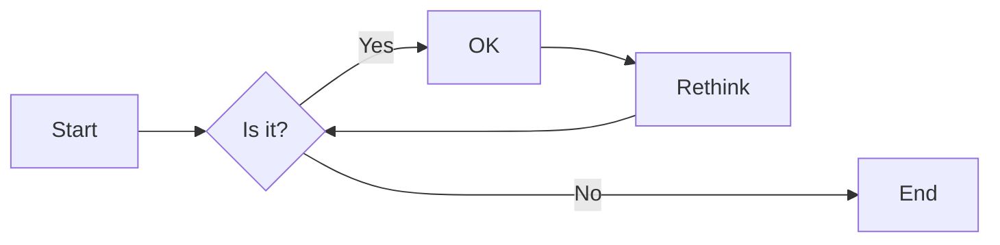

# 实验五 Python数据结构与数据模型

班级： 21计科1

学号： 202302200000

姓名： 张三

Github地址：<https://github.com/yourusername/python_course>

CodeWars地址：<https://www.codewars.com/users/yourusername>

---

## 实验目的

1. 学习Python数据结构的高级用法
2. 学习Python的数据模型

## 实验环境

1. Git
2. Python 3.10
3. VSCode
4. VSCode插件

## 实验内容和步骤

### 第一部分

在[Codewars网站](https://www.codewars.com)注册账号，完成下列Kata挑战：

---

#### 第一题：停止逆转我的单词

难度： 6kyu

编写一个函数，接收一个或多个单词的字符串，并返回相同的字符串，但所有5个或更多的字母单词都是相反的（就像这个Kata的名字一样）。传入的字符串将只由字母和空格组成。只有当出现一个以上的单词时，才会包括空格。
例如：

```python
spinWords( "Hey fellow warriors" ) => returns "Hey wollef sroirraw" 
spinWords( "This is a test") => returns "This is a test" 
spinWords( "This is another test" )=> returns "This is rehtona test"
```

代码提交地址：
<https://www.codewars.com/kata/5264d2b162488dc400000001>

提示：

- 利用str的split方法可以将字符串分为单词列表
例如：

```python
words = "hey fellow warrior".split()
# words should be ['hey', 'fellow', 'warrior']
```

- 利用列表推导将长度大于等于5的单词反转(利用切片word[::-1])
- 最后使用str的join方法连结列表中的单词。

---

#### 第二题： 发现离群的数(Find The Parity Outlier)

难度：6kyu

给你一个包含整数的数组（其长度至少为3，但可能非常大）。该数组要么完全由奇数组成，要么完全由偶数组成，除了一个整数N。请写一个方法，以该数组为参数，返回这个 "离群 "的N。

例如：

```python
[2, 4, 0, 100, 4, 11, 2602, 36]
# Should return: 11 (the only odd number)

[160, 3, 1719, 19, 11, 13, -21]
# Should return: 160 (the only even number)
```

代码提交地址：
<https://www.codewars.com/kata/5526fc09a1bbd946250002dc>

---

#### 第三题： 检测Pangram

难度：6kyu

pangram是一个至少包含每个字母一次的句子。例如，"The quick brown fox jumps over the lazy dog "这个句子就是一个pangram，因为它至少使用了一次字母A-Z（大小写不相关）。

给定一个字符串，检测它是否是一个pangram。如果是则返回`True`，如果不是则返回`False`。忽略数字和标点符号。
代码提交地址：
<https://www.codewars.com/kata/545cedaa9943f7fe7b000048>

---

#### 第四题： 数独解决方案验证

难度：6kyu

数独背景

数独是一种在 9x9 网格上进行的游戏。游戏的目标是用 1 到 9 的数字填充网格的所有单元格，以便每一列、每一行和九个 3x3 子网格（也称为块）中的都包含数字 1 到 9。更多信息请访问：<http://en.wikipedia.org/wiki/Sudoku>

编写一个函数接受一个代表数独板的二维数组，如果它是一个有效的解决方案则返回 true，否则返回 false。数独板的单元格也可能包含 0，这将代表空单元格。包含一个或多个零的棋盘被认为是无效的解决方案。棋盘总是 9 x 9 格，每个格只包含 0 到 9 之间的整数。

代码提交地址：
<https://www.codewars.com/kata/63d1bac72de941033dbf87ae>

---

#### 第五题： 疯狂的彩色三角形

难度： 2kyu

一个彩色的三角形是由一排颜色组成的，每一排都是红色、绿色或蓝色。连续的几行，每一行都比上一行少一种颜色，是通过考虑前一行中的两个相接触的颜色而产生的。如果这些颜色是相同的，那么新的一行就使用相同的颜色。如果它们不同，则在新的一行中使用缺失的颜色。这个过程一直持续到最后一行，只有一种颜色被生成。

例如：
```python
Colour here:            G G        B G        R G        B R
Becomes colour here:     G          R          B          G
```


一个更大的三角形例子：

```python
R R G B R G B B
 R B R G B R B
  G G B R G G
   G R G B G
    B B R R
     B G R
      R B
       G
```

你将得到三角形的第一行字符串，你的工作是返回最后的颜色，这将出现在最下面一行的字符串。在上面的例子中，你将得到 "RRGBRGBB"，你应该返回 "G"。
限制条件： 1 <= length(row) <= 10 ** 5
输入的字符串将只包含大写字母'B'、'G'或'R'。

例如：

```python
triangle('B') == 'B'
triangle('GB') == 'R'
triangle('RRR') == 'R'
triangle('RGBG') == 'B'
triangle('RBRGBRB') == 'G'
triangle('RBRGBRBGGRRRBGBBBGG') == 'G'
```

代码提交地址：
<https://www.codewars.com/kata/5a331ea7ee1aae8f24000175>

提示：请参考下面的链接，利用三进制的特点来进行计算。
<https://stackoverflow.com/questions/53585022/three-colors-triangles>

---

### 第二部分

使用Mermaid绘制程序流程图

安装VSCode插件：

- Markdown Preview Mermaid Support
- Mermaid Markdown Syntax Highlighting

使用Markdown语法绘制你的程序绘制程序流程图（至少一个），Markdown代码如下：


显示效果如下：



查看Mermaid流程图语法-->[点击这里](https://mermaid.js.org/syntax/flowchart.html)

使用Markdown编辑器（例如VScode）编写本次实验的实验报告，包括[实验过程与结果](#实验过程与结果)、[实验考查](#实验考查)和[实验总结](#实验总结)，并将其导出为 **PDF格式** 来提交。

## 实验过程与结果

请将实验过程与结果放在这里，包括：

- [第一部分 Codewars Kata挑战](#第一部分)
- [第二部分 使用Mermaid绘制程序流程图](#第二部分)

注意代码需要使用markdown的代码块格式化，例如Git命令行语句应该使用下面的格式：


显示效果如下：

```bash
git init
git add .
git status
git commit -m "first commit"
```

如果是Python代码，应该使用下面代码块格式，例如：


显示效果如下：

```python
def add_binary(a,b):
    return bin(a+b)[2:]
```

代码运行结果的文本可以直接粘贴在这里。

**注意：不要使用截图，因为Markdown文档转换为Pdf格式后，截图会无法显示。**

## 实验考查

请使用自己的语言并使用尽量简短代码示例回答下面的问题，这些问题将在实验检查时用于提问和答辩以及实际的操作。

1. 集合（set）类型有什么特点？它和列表（list）类型有什么区别？
```
集合（set）类型是Python中的一种无序、可变的数据类型，它具有以下几个特点：
1. 无序性：集合中的元素没有固定的顺序，每次输出的顺序可能不同。
2. 唯一性：集合中的元素是唯一的，不会出现重复的元素。
3. 可变性：集合是可变的，可以添加、删除和修改集合中的元素.

集合类型和列表（list）类型之间有以下几个区别：
1. 顺序性：列表是有序的，元素的顺序是固定的，可以通过索引访问和修改元素。而集合是无序的，元素的顺序是不确定的，不能通过索引访问和修改元素。
2. 唯一性：列表中可以包含重复的元素，而集合中的元素是唯一的，不会出现重复。
3. 可变性：列表是可变的，可以通过索引对元素进行修改、添加和删除。而集合也是可变的，可以添加和删除元素，但不能通过索引对元素进行修改。
4. 存储方式：列表使用方括号（`[]`）来表示，元素之间使用逗号分隔。而集合使用花括号（`{}`）来表示，元素之间也使用逗号分隔。
```
2. 集合（set）类型主要有那些操作？
```
集合（set）类型在Python中具有以下常用的操作：
1. 创建集合：可以使用花括号（`{}`）或`set()`函数来创建一个空集合，或者使用花括号包围元素来创建一个非空集合。
2. 添加元素：使用`add()`方法向集合中添加一个元素，如果元素已经存在，则不会重复添加。
3. 删除元素：使用`remove()`方法从集合中删除指定的元素，如果元素不存在，则会引发`KeyError`错误。另外，还可以使用`discard()`方法删除元素，如果元素不存在，则不会引发错误。
4. 集合运算：可以使用运算符或集合方法进行集合之间的运算，包括并集（`union()`或`|`）、交集（`intersection()`或`&`）、差集（`difference()`或`-`）、对称差集（`symmetric_difference()`或`^`）等。
5. 集合操作：可以使用集合方法来判断集合之间的关系，包括判断是否为子集（`issubset()`或`<=`）、判断是否为超集（`issuperset()`或`>=`）、判断是否没有交集（`isdisjoint()`）等。
6. 遍历集合：可以使用`for`循环来遍历集合中的元素。
```   
3. 使用`*`操作符作用到列表上会产生什么效果？为什么不能使用`*`操作符作用到嵌套的列表上？使用简单的代码示例说明。

```
在Python中，使用*操作符作用到列表上会将列表中的元素重复多次。具体来说，list * n会生成一个新的列表，其中包含原列表中的元素重复n次。
例如，如果我们有一个列表my_list = [1, 2, 3]，使用*操作符将其重复两次，可以得到[1, 2, 3, 1, 2, 3]。
然而，不能直接使用*操作符作用到嵌套的列表上，因为*操作符只会复制列表的引用，而不会复制列表的内容。这意味着，如果我们将嵌套的列表重复多次，实际上得到的是多个引用指向同一个列表对象，而不是多个独立的列表对象.
```
```nested_list = [[1, 2], [3, 4]]
repeated_list = nested_list * 2
print(repeated_list)
# 输出：[[1, 2], [3, 4], [1, 2], [3, 4]]
nested_list[0][0] = 5
print(repeated_list)
# 输出：[[5, 2], [3, 4], [5, 2], [3, 4]]
```
4. 总结列表,集合，字典的解析（comprehension）的使用方法。使用简单的代码示例说明。
```
列表解析（List Comprehension）是一种简洁的语法，用于从一个可迭代对象（如列表、元组、字符串等）中创建一个新的列表。列表解析的基本语法是在一个方括号内使用一个表达式，可以包含一个或多个循环和条件语句。

下面是一个简单的示例，使用列表解析从一个列表中创建一个新的列表，其中包含原列表中的偶数元素：
```

```
numbers = [1, 2, 3, 4, 5, 6]
even_numbers = [x for x in numbers if x % 2 == 0]
print(even_numbers)  # 输出：[2, 4, 6]
```

```
集合解析（Set Comprehension）和列表解析非常相似，只是用花括号 `{}` 替代了方括号 `[]`。集合解析用于从一个可迭代对象中创建一个新的集合。
下面是一个示例，使用集合解析从一个列表中创建一个新的集合，其中包含原列表中的奇数元素：
```

```
numbers = [1, 2, 3, 4, 5, 6]
odd_numbers = {x for x in numbers if x % 2 != 0}
print(odd_numbers)  # 输出：{1, 3, 5}
```

```
字典解析（Dictionary Comprehension）是一种创建字典的简洁方法。字典解析使用花括号 `{}` 和冒号 `:` 来指定键值对。可以在解析中使用一个或多个循环和条件语句。
下面是一个示例，使用字典解析从一个列表中创建一个新的字典，其中键是列表中的元素，值是元素的平方：
```

```python
numbers = [1, 2, 3, 4, 5, 6]
squared_dict = {x: x**2 for x in numbers}
print(squared_dict)  # 输出：{1: 1, 2: 4, 3: 9, 4: 16, 5: 25, 6: 36}
```

需要注意的是，字典解析中的键必须是唯一的，否则后面的键值对会覆盖前面的键值对。

总结：
- 列表解析用于从一个可迭代对象中创建一个新的列表，语法为 `[expression for item in iterable if condition]`。
- 集合解析用于从一个可迭代对象中创建一个新的集合，语法为 `{expression for item in iterable if condition}`。
- 字典解析用于从一个可迭代对象中创建一个新的字典，语法为 `{key_expression: value_expression for item in iterable if condition}`。

## 实验总结

总结一下这次实验你学习和使用到的知识，例如：编程工具的使用、数据结构、程序语言的语法、算法、编程技巧、编程思想。
